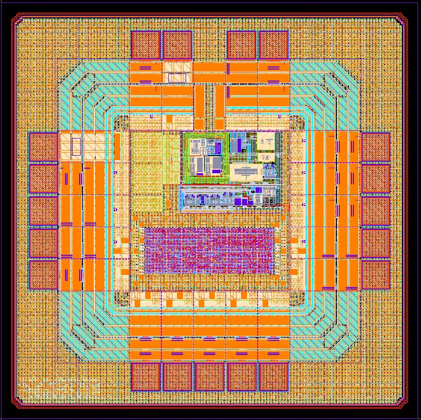

# SoC2263

Single-technology IP library.

- doc/     : user documentation
- dependencies/ : sub-cells and blocks
- release/v.1.0.0 : immutable versioned deliveries




| | |
|---|---|
| **Category** | Mixed-Signal SoC |
| **Technology** | IHP SG13CMOS |
| **Top Cell** | `SoC2263` |
| **Die Size** | 1.04 mm × 1.04 mm |
| **License** | Apache-2.0 |

---

## Overview

SoC2263 is a purpose-built SoC for precision agriculture featuring ±2°C accurate PT100 temperature sensing across the -10°C to +50°C range that uses the SG13CMOS IHP 130nm technology node.

## Application

Our SoC can be used for a variety of applications, including but not limited to:
 - Agriculture temperature monitoring
 - Fruit ripening rooms: Monitoring that bananas or avocados stay within strict temperature bands during ethylene gas treatment.
 - Milk cooling tanks: Ensuring bulk milk tanks maintain temperatures below 4°C to prevent bacterial growth before collection.
 - Floriculture shipping: Tracking cut flower containers during transit to ensure they don’t freeze (below 0°C) or overheat.
 - Soil temperature monitoring: Ensuring optimal germination temperatures for seeds (e.g., tomatoes, peppers) without needing lab-grade precision.

### Features

- **Power Consumption** - Digtal FSM that manage the power consuption
- **Digital/Analog Output** — Compatible with all systems analog/mixed and digital
- **UART interface** - Universal interface, allowing users to control threshold values and test the chip
- **High precistion** - Durable ±2°C sensor designed for the practical demands of precision agriculture.
---

### Prerequisites

- [IHP SG13G2 Open PDK](https://github.com/IHP-GmbH/IHP-Open-PDK)
- [LibreLane](https://github.com/efabless/librelane)
- [Icarus Verilog](http://iverilog.icarus.com/)

## License

Licensed under the [Apache License 2.0](https://www.apache.org/licenses/LICENSE-2.0).

```

Licensed under the Apache License, Version 2.0 (the "License");
you may not use this file except in compliance with the License.
You may obtain a copy of the License at

    http://www.apache.org/licenses/LICENSE-2.0
```
